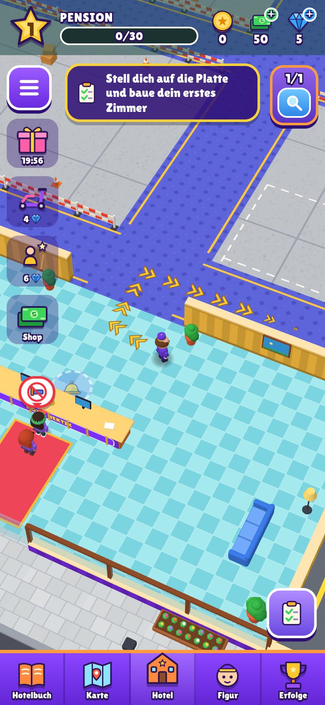
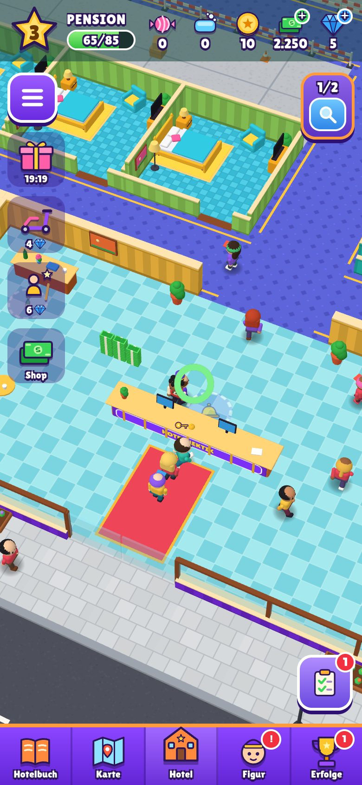
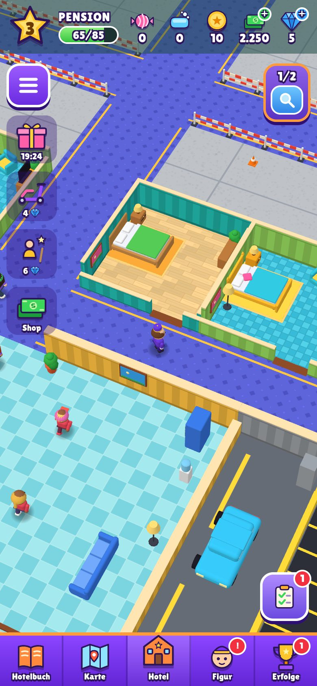
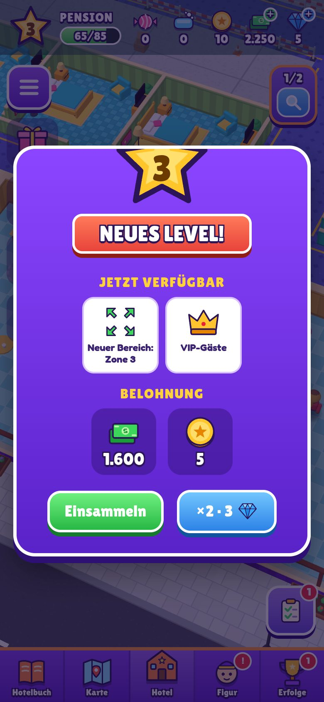

# Hotel Hektik

Ein Arcade-Idle-Hotelspiel im Browser – mechanisch nachgebaut nach der
**Rekonstruktionsspezifikation v5** (`docs/spezifikation-v5.md`), mit eigenem
Titel, eigenen Figuren und komplett prozedural erzeugter Grafik (Three.js).

Du bist Page in der *Pension Seeblick*: Gäste einchecken, Bargeld einsammeln,
Zimmer putzen, Klopapier nachfüllen – und mit dem verdienten Geld Zimmer,
Personal und neue Bereiche kaufen, bis das Hotel mit Aufzug und Lounge
komplett ist.

<p>
  
  
  
  
</p>

## Starten

```bash
npm install
npm run dev          # Entwicklungsserver (auch im LAN, fürs Handy)
npm run build        # Produktions-Build nach dist/
npm run build:single # eine einzige HTML-Datei: dist-single/hotel-hektik.html
npm test             # Balancing- und Freischaltgraph-Tests (Node ≥ 22.18)
```

Die Datei aus `npm run build:single` enthält alles (Code, Styles, Schriften) und
läuft ohne Server direkt im Browser – praktisch zum Verschicken oder zum
Hochladen auf einen beliebigen Webspace. `dist/` lässt sich ebenso statisch
hosten (relative Pfade, z. B. GitHub Pages).

**Steuerung:** Auf dem Handy irgendwo auf den Bildschirm tippen und ziehen
(schwebender Stick), am Rechner WASD/Pfeiltasten oder Maus ziehen. Alle
Aktionen passieren durch **Betreten** – Kaufplatten, Tresen, Schmutzstellen,
Geldstapel, Lager und Toiletten sind Trigger-Zonen (§1).

## Was umgesetzt ist

| Bereich | Umsetzung | Spezifikation |
|---|---|---|
| Kernschleife | Warteschlange → Check-in → Bargeld auf den Tresen → Zimmer → 1 s hinlegen, **3 s Nachtphase mit Raumverdunkelung** und Zzz, 1 s aufstehen → Zimmer **DIRTY mit genau 3 Schmutzpunkten** | §2, §7 |
| Drei tragende Regeln | Personal sammelt **nie** Geld ein; Geld liegt physisch in Stapeln à **10 Bündeln**; keine Abwanderung, kein Zufriedenheitssystem | §2, §8 |
| Sternökonomie | kumulative Sterne, Schwellen 30/50/85/115/145/180/240, Belohnungen aus `LevelRewardSettings`, „MAX“ bei Level 8 | §3 |
| Preise | vollständige Tabelle (46 Einträge), **keine Formel**; Prestige-Durchläufe ×2,5 / ×4,5 | §4 |
| Einnahmen | Zimmer 10/30/50, Deluxe (RoomRW) 40/60, Trinkgeld 20 %, Toilette 20, Parkplatz 20, VIP-Trinkgeld 10, Passivwerte für Offline-Fortschritt | §5 |
| Grundriss | 7 Zonen × (3 Zimmer + WC-Block mit 3 Kabinen) + Cleaner-Posten, Lobby mit Rezeption bei (0,0), Lager/Lieferant vorne links, Parkplatz vorne rechts, Aufzug hinten auf der Mittelachse, Zimmerraster 7,5, Grundfläche ≈ 66 × 60 | §6 |
| Freischaltgraph | 114 Knoten, belegte Kanten (Zimmer 1 ⇐ Toilette, Stufe 2 ⇐ Cleaner 3) exakt übernommen | §6 |
| Kaufmechanik | Platte betreten → Ease-out-Zahlung mit **konstanter Dauer ≈ 3,2 s**, Fortschritt bleibt beim Verlassen erhalten | §9 |
| Personal | Cleaner je Zone (Tempo 1,8/2,3/3,0/4,0, Arbeitsrate 0,5/0,8/1,0/1,5), Rezeptionist (bis 2 Tresen), Lieferant mit Klopapier-Logistik (5 Stufen), Parkwächter | §10 |
| Spielerfigur | Tokens für Tempo/Tragkraft/Geldmagnet (3…18) und Rucksack (3…48), Basis-Tragkraft 3, Roller +50 % für 3 Minuten | §11 |
| Währungen | Bargeld, Bonbons (`candy`), Seife (`toiletpaper`) pro Hotel; Tokens und Gems global | §12 |
| Sondergäste & VIP | VIP alle 300 s mit Countdown; Sondergäste alle 420 s mit drei Wünschen (Gepäck aufs Zimmer, Champagner, Blumen, Handtuch, Kaffee), Belohnung 500 + Ressourcen | §13 |
| UI | HUD-Leiste (#1D4946 @ 55 %), Level-Stern, Währungen, Shop-Angebote mit Countdown, Aufgabenfinder, Sondergast-/VIP-/Aushilfe-Timer, Auftragsbuch, fünf Reiter, Level-Up-Fenster mit „Jetzt verfügbar“ und ×2, Zimmer-Design-Auswahl, Weltkarte mit 17 Hotels, Bodennavigation mit gelben Chevrons | §14 |
| Stil | gesättigte Farben, jede Zimmerstufe ein eigener Farbakkord (grün-braun-blau / türkis-beige-grün / hellgrün-cyan-gold), Weiß nur als Kontur/Text, Lambert-Materialien, Blob-Schatten | §15 |
| Technik | Vite + TypeScript + Three.js, Wegpunkt-Graph statt Navmesh, InstancedMesh für Geld und Schatten, `localStorage` + Offline-Fortschritt | §16 |

## Abweichungen und eigene Entscheidungen

Die Spezifikation markiert Werte als 📦 (aus den Balancing-Tabellen, maßgeblich)
oder 🔧 (rekonstruiert). Alle 📦-Werte sind unverändert in
`src/config/balance.ts` übernommen. Wo etwas fehlte oder sich widersprach:

- **Kaufkurve:** Der Code-Schnipsel in §9 (`max(kosten/3, rest·3)`) ergibt nur
  ≈ 1 s. Die gemessenen Deltas (≈450 → ≈250 → 11 → 1 je Viertelsekunde, 3.310
  in 3,2 s) passen exakt zu einem quadratischen Ease-out mit T = 3,2 s – das ist
  umgesetzt und im Test abgesichert.
- **Sternbilanz:** `zone_1.room_01` hat laut Preistabelle nur zwei Stufen, daher
  sind maximal **243** statt 248 Sterne erreichbar. Die Schwelle 240 bleibt
  erreichbar; Zone 1 ergibt genau die 30 Sterne für Level 2.
- **Belohnungstripel** (z. B. 5400/13500/24300 und 5/10/20): Die Faktoren
  entsprechen genau den Prestige-Blöcken (×2,5/×4,5). Sie werden daher als
  Belohnung je Durchlauf verwendet; „×2“ im Level-Up-Fenster verdoppelt.
- **Grundriss und Farbpalette:** `mph-floorplan.json` und `mph-farbpalette.json`
  lagen nicht bei. Der Grundriss ist eine eigene Anordnung (Mittelflur mit drei
  Querfluren), die die belegten Kennzahlen einhält; die Zellbelegung folgt den
  Zimmernummern der Preistabelle (die fehlende Nummer je Zone ist der WC-Block).
- **Werbefrei:** Werbevideos entfallen. Deluxe-Designs, Verdopplungen und
  Shop-Artikel kosten Gems, die es für Aufträge, Erfolge, Sondergäste und das
  Gratis-Geschenk gibt. Ressourcen kommen von Sondergästen (ohne Gegenleistung
  bedienbar) und fallen mit kleiner Chance bei normalen Gästen ab (§12,
  Designentscheidung).
- **Ressourcen beim Level-Up:** Zusätzlich zu Bargeld und Tokens aus
  `LevelRewardSettings` gibt es ein paar Bonbons und Seife
  (`LEVEL_RES_BONUS`), damit Zonen und Personal nicht an Werbevideos hängen.
- **Toilettennutzung:** 55 % der Gäste gehen nach dem Aufenthalt zur Toilette
  ihrer Zone (abgeleitet aus den Passivwerten §5); ohne Papier gehen sie einfach.
- **Personaltempo:** Die Unity-Tempi werden mit Faktor 1,4 auf die Weltgröße
  umgerechnet; das Verhältnis Cleaner:Spieler bleibt erhalten.

## Getestet

- `npm test`: 13 Tests – Preistabelle, Levelschwellen und Einnahmen gegen die
  Spezifikation, kompletter Freischaltgraph bis Level 8, Kaufkurve,
  Erreichbarkeit aller Wegpunkte.
- Automatisierte Durchläufe im Headless-Browser: Tutorial, alle 114 Käufe,
  Sonderwünsche, Parkplatz, Speichern/Laden, Offline-Ertrag, Prestige,
  Touch-Stick sowie Hoch-, Quer- und Desktop-Layout.
- Ein Bot hat das Hotel im Zeitraffer vollständig durchgespielt (Level 8 nach
  ≈ 150 Spielminuten, ≈ 3.700 Check-ins) – ohne hängende Gäste oder Fehler.

## Rechtliches

Umgesetzt sind Spielmechaniken, Regeln und Zahlenwerte (§18). Name, Logo,
Figuren, Modelle, Texturen, Sounds und Texte sind eigene: alle 3D-Objekte werden
aus Grundkörpern gebaut, Texturen per Canvas gezeichnet, Icons als eigene
SVG-Pfade, Sounds per WebAudio synthetisiert. Schriften: *Lilita One* und
*Fredoka* (SIL Open Font License, via Fontsource).

## Projektstruktur

```
src/
  config/     Balancing (balance.ts), Freischaltgraph (progression.ts),
              Grundriss (floorplan.ts, layout.ts), Palette, Texte
  world/      Renderer/Kamera, Geometrie-Baukasten, Texturen, Möbel,
              Figuren, Gebäude, Zimmer-/WC-Zellen, Kollision
  game/       Spiellogik: Game, Gäste, Personal, Spieler, Kaufplatten,
              Geld, Parkplatz, Sondergäste, Aufträge, Speichern, Wegpunkte
  ui/         HUD, Fenster & Seiten, Welt-Overlays, Icons, CSS
  audio/      Soundeffekte (WebAudio)
tests/        Node-Tests für Balancing und Graph
docs/         Spezifikation v5
```

## Debug-Parameter

`?debug` stellt das Spielobjekt als `window.hotel` bereit; dazu
`&speed=3` (Zeitraffer), `&cash=5000`, `&gems=50`, `&tokens=50`, `&res=30`,
`&skiptut` und `&norender` (Spiellogik ohne 3D-Ausgabe, für Langzeittests).
Im Menü lässt sich der Spielstand zurücksetzen.
